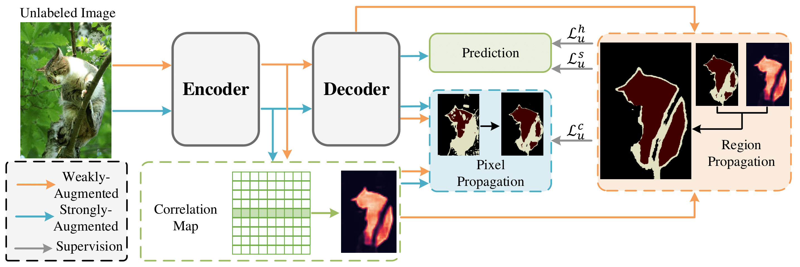

# CorrMatch-Jittor (CVPR 2024)

This repository contains the Jittor version implementation of the following paper:

> **[CorrMatch: Label Propagation via Correlation Matching for Semi-Supervised Semantic Segmentation](https://arxiv.org/abs/2306.04300)**</br>
> [Boyuan Sun](https://bbbbchan.github.io), [Yuqi Yang](https://github.com/BBBBchan/CorrMatch), [Le Zhang](http://zhangleuestc.cn/), [Ming-Ming Cheng](https://mmcheng.net/cmm/),  [Qibin Hou](https://houqb.github.io/)</br>

🔥 Our paper is accepted by IEEE Computer Vision and Pattern Recognition (CVPR) 2024 !!!

## Overview
CorrMatch provides a solution for mining more high-quality regions from the unlabeled images to leverage the unlabeled data more efficiently for consistency regularization.


Previous approaches mostly employ complicated training strategies to leverage unlabeled data but overlook the role of correlation maps in modeling the relationships between pairs of locations. Thus, we introduce two label propagation strategies (Pixel Propagation and Region Propagation) with the help of correlation maps. 

For technical details, please refer to our full paper on [arXiv](https://arxiv.org/abs/2306.04300).
## Getting Started

### Installation

```bash
git clone git@github.com:BBBBchan/CorrMatch-Jittor.git
cd CorrMatch
conda create -n corrmatch python=3.11
conda activate corrmatch
sudo apt install openmpi-bin openmpi-common libopenmpi-dev
pip install jittor
pip install opencv-python tqdm einops pyyaml matplotlib
```

### Pretrained Backbone:
[ResNet-101](https://drive.google.com/file/d/1Rx0legsMolCWENpfvE2jUScT3ogalMO8/view?usp=sharing)
```bash
mkdir pretrained
```
Please put the pretrained model under `pretrained` dictionary.


### Dataset:

- Pascal VOC 2012: [JPEGImages](http://host.robots.ox.ac.uk/pascal/VOC/voc2012/VOCtrainval_11-May-2012.tar) | [SegmentationClass](https://drive.google.com/file/d/1ikrDlsai5QSf2GiSUR3f8PZUzyTubcuF/view?usp=sharing)
- Cityscapes: [leftImg8bit](https://www.cityscapes-dataset.com/file-handling/?packageID=3) | [gtFine](https://drive.google.com/file/d/1E_27g9tuHm6baBqcA7jct_jqcGA89QPm/view?usp=sharing)

Please modify the dataset path in configuration files.*The groundtruth mask ids have already been pre-processed. You may use them directly.*

Your dataset path may look like:
```
├── [Your Pascal Path]
    ├── JPEGImages
    └── SegmentationClass
    
├── [Your Cityscapes Path]
    ├── leftImg8bit
    └── gtFine
```

## Usage

### Training CorrMatch

```bash
sh tools/train.sh 
```
To run on different labeled data partitions or different datasets, please modify:

``config``, ``labeled_id_path``, ``unlabeled_id_path``, and ``save_path`` in [train.sh](https://github.com/BBBBchan/CorrMatch-Jittor/blob/main/tools/train.sh).


## Citation

If you find our repo useful for your research, please consider citing our paper:

```bibtex
@article{sun2023corrmatch,
  title={CorrMatch: Label Propagation via Correlation Matching for Semi-Supervised Semantic Segmentation},
  author={Sun, Boyuan and Yang, Yuqi and Zhang, Le and Cheng, Ming-Ming and Hou, Qibin},
  journal={IEEE Computer Vision and Pattern Recognition (CVPR)},
  year={2024}
}
```

## License
This code is licensed under the [Creative Commons Attribution-NonCommercial 4.0 International](https://creativecommons.org/licenses/by-nc/4.0/) for non-commercial use only.
Please note that any commercial use of this code requires formal permission prior to use.

## Contact

For technical questions, please contact `sbysbysby123[AT]gmail.com`.

For commercial licensing, please contact `cmm[AT]nankai.edu.cn` or `andrewhoux@gmail.com`.

## Acknowledgement

We thank [UniMatch](https://github.com/LiheYoung/UniMatch), [CPS](https://github.com/charlesCXK/TorchSemiSeg), [CutMix-Seg](https://github.com/Britefury/cutmix-semisup-seg), [DeepLabv3Plus](https://github.com/YudeWang/deeplabv3plus-pytorch),  [U<sup>2</sup>PL](https://github.com/Haochen-Wang409/U2PL) and other excellent works (see this [project](https://github.com/BBBBchan/Awesome-Semi-Supervised-Semantic-Segmentation)) for their amazing projects!
